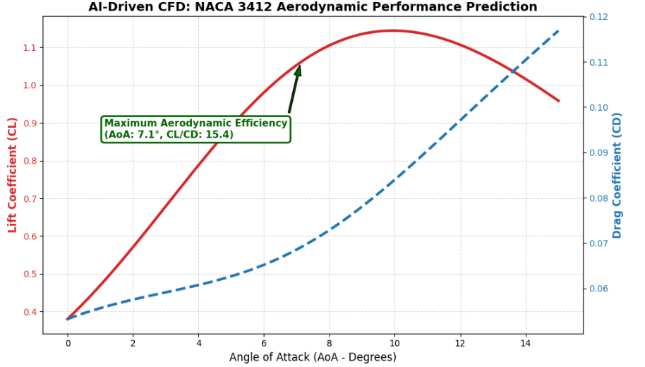

# AI-Driven Aerodynamics: CFD Surrogate Model

## 📌 Overview
Traditional Computational Fluid Dynamics (CFD) simulations (e.g., solving Navier-Stokes equations via OpenFOAM/SimFlow) are computationally expensive and time-consuming. This project develops a **Machine Learning Surrogate Model** using a Multi-Layer Perceptron (MLP) Neural Network to predict the aerodynamic performance of NACA airfoils in milliseconds.

## ⚙️ Methodology & Data
*   **Data Source:** Ground truth data was generated using **SimFlow** (OpenFOAM based) for a NACA 2412 airfoil across varying angles of attack, camber geometries, and Reynolds numbers (See the attached PDF report for the full CFD setup and mesh parameters).
*   **Algorithm:** Scikit-Learn `MLPRegressor` (Multi-Output Neural Network).
*   **Inputs (Features):** Max Camber (%), Camber Position (%), Angle of Attack (Degrees), Freestream Velocity (m/s).
*   **Outputs (Targets):** Lift Coefficient ($C_L$), Drag Coefficient ($C_D$).

## 🚀 Results & Performance
The trained Neural Network successfully captures complex fluid dynamics, including boundary layer separation (stall conditions) and non-linear drag increases, without running iterative CFD solvers. 

As seen in the prediction below for a new unseen airfoil (NACA 3412), the model correctly identifies the point of **Maximum Aerodynamic Efficiency ($C_L/C_D$)** and the stall region entry based solely on learned physics.

## 💻 How to Use
1. Clone this repository.
2. Ensure you have `pandas`, `numpy`, `matplotlib`, and `scikit-learn` installed.
3. Run `cfd_surrogate_model.py` to instantly predict the aerodynamic coefficients for new airfoil geometries.
